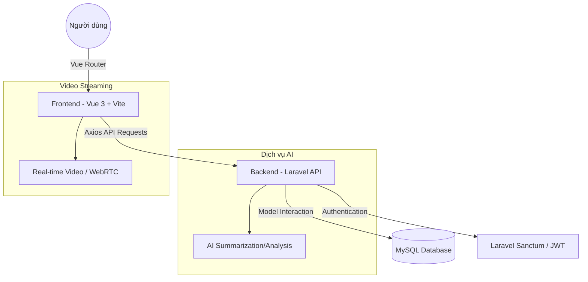

# 🚀 AI-Meet: Nền tảng Họp Trực tuyến Thông minh

<div align="center">
  
  <p><i>Kiến tạo không gian số thông minh - Kết nối mọi lúc, mọi nơi.</i></p>
</div>

---

## 🌟 Tổng quan dự án

**AI-Meet** là nền tảng hội nghị truyền hình thế hệ mới, được thiết kế để mang lại trải nghiệm cộng tác đỉnh cao. Tích hợp trí tuệ nhân tạo (AI) giúp tối ưu hóa luồng công việc, từ việc quản lý hồ sơ đối tác đến việc tạo ra các không gian họp 4K HDR bảo mật và chuyên nghiệp.

> [!TIP]
> Hệ thống sử dụng giao diện **Neo-Futuristic** với hiệu ứng kính mờ (Glassmorphism) và Cyber-animations độc quyền, mang lại cảm giác công nghệ tương lai trên từng khung hình.

---

## ✨ Tính năng nổi bật

| Tính năng | Mô tả | Trạng thái |
| :--- | :--- | :---: |
| 🛡️ **Bảo mật đa tầng** | Xác thực OTP & JWT cho người dùng và đối tác. | ✅ |
| 🤖 **Trợ lý AI** | Tích hợp xử lý ngôn ngữ tự nhiên trong phòng họp. | 🚧 |
| 🎨 **Neo-UI Design** | Giao diện hiện đại, tối ưu trải nghiệm (UX). | ✅ |
| ☁️ **Cloud Sync** | Đồng bộ hóa hồ sơ và lịch họp trên đám mây. | ✅ |
| 📽️ **4K HDR Video** | Chất lượng truyền tải hình ảnh độ phân giải cao. | ✅ |

---

## 🛠️ Công nghệ sử dụng

### **Frontend**


### **Backend**


---

## 🏗️ Kiến trúc hệ thống



---

## ⚙️ Hướng dẫn cài đặt

### 1. Yêu cầu hệ thống
- PHP >= 8.1
- Node.js >= 16.x
- Composer & NPM / Yarn
- MySQL / MariaDB

### 2. Thiết lập Backend (BE)
```bash
# Di chuyển vào thư mục BE
cd BE

# Cài đặt dependencies
composer install

# Tạo file cấu hình môi trường
cp .env.example .env

# Tạo application key
php artisan key:generate

# Khởi tạo database & seed dữ liệu
php artisan migrate --seed

# Chạy server
php artisan serve
```

### 3. Thiết lập Frontend (FE)
```bash
# Di chuyển vào thư mục FE
cd FE

# Cài đặt dependencies
npm install

# Cấu hình API URL trong .env
vibr VITE_API_URL=http://127.0.0.1:8000/api

# Chạy ứng dụng ở chế độ development
npm run dev
```

---

## 📸 Ảnh chụp giao diện

### Trang đăng nhập (Neo-Futuristic UI)
<div align="center">
  
</div>

---

## 📄 Giấy phép
Distributed under the **MIT License**. See `LICENSE` for more information.

---
<div align="center">
  <p>Được xây dựng với ❤️ bởi Nhóm Phát triển GR62</p>
</div>
